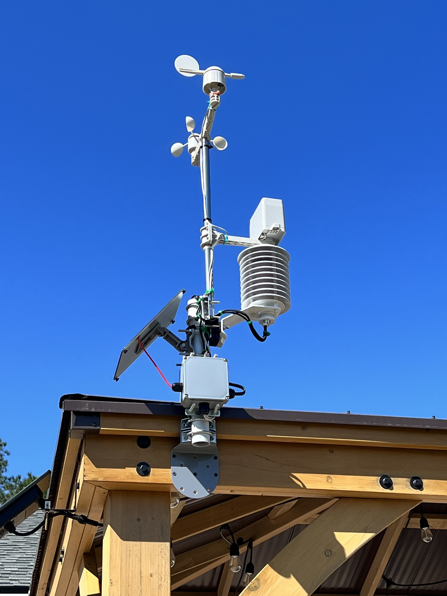

# Solar Powered ESP32-C3-Mini Weather Station with DS18B20

[](lib-release)
[](lib-release)
[](lib-stars)
[](lib-issues)
[](lib-licence)

## Image of project



## Schematic


## Grafana Dashboard


## Description

:cloud: :cyclone: :ocean: :zap: :sunny: :umbrella: :snowman: :foggy:

This project is powered by a solar panel that charges a lithium ion battery through a Sparkfun "solar buddy" board. The code is written in MicroPython on an ESP32-C3-Mini. The microcontroller collects data from the rain, wind (speed & direction), humidity, pressure, and temperature sensors in a variety of ways (i.e. i2c, oneWire, ADC, and electrical pulse interrupts). The data is collected every 5 seconds, then averaged at the end of two minutes and placed into a dictionary data structure. The dictionary is converted to JSON and sent to my Wunderground PWS site <https://www.wunderground.com/dashboard/pws/KFLJACKS4049> where my data and other users data get stored for public consumption. There is a Telegraf listener running in a docker container on my local network (repo for docker telegraf-influxdb-grafana stack -> <https://github.com/jcksnvllxr80/docker-telegraf-influx-grafana>) which takes JSON requests via API and converts the data into a protocol that influxDb speaks. There are two Telegraf outputs; one goes to the local influxdb running in docker and the other goes to a Prometheus plugin running in my Grafana Cloud account. Both databases allow me to make beautiful charts and graphs to show and analyze the weather data. All connections to the network are via Wi-Fi connection on my Google Wifi (Mesh) LAN. 

## Prerequisites

The following classes (which are all in this repo) must be manually loaded onto the esp32-c3 for this project to work (main.py also necessary):

- conf directory with 'config.json' inside... use the example i provided (will need to use an online converter to base64 encode your ssid and password)
- ``base64.py``
- ``time_utils.py``
- ``http_utils.py``
- ``api_utils.py``
- ``mrequests.py``
- ``weather.py``
- ``am2320.py``
- ``mpl3115a2.py``

## Erase and flash micropython on the ESP32-C3-Mini from windows CMD

- download and unzip <https://github.com/espressif/esptool>
- download the MicroPython firmware <https://micropython.org/download/esp32c3/> (esp32c3-20220225-unstable-v1.18-160-g0a217624e.bin)
- for the next step I used anaconda prompt (you may have to install dependencies)
- python esptool.py -p COM<your_com_num> -b 1000000 --before default_reset erase_flash
- python esptool.py -p COM<your_com_num> -b 1500000 --before default_reset write_flash -z 0x0000 esp32c3-20220225-unstable-v1.18-160-g0a217624e.bin
- the above two commands worked for me but here is a helpful link just in case: <http://embedded-things.blogspot.com/2021/10/flash-micropython-firmware-on-esp32-c3.html>

## TODO

- add ability to take asynchronous requests over network via API so that local nagios can query weather status
- get a UV sensor

## Weather Vane voltage values and direction table

| Dir      | Ri          | Vi        | Angle      | R           | Vo          | ADC         |
| :---     |    :----:   |   :----:  |   :----:   |    :----:   |    :----:   |        ---: |
| N        | 33000       | 3.3       | 0          | 33000       | 1.650       | 2335        |
| N/NE     | 33000       | 3.3       | 22.5       | 6570        | 0.548       | 930         |
| NE       | 33000       | 3.3       | 45         | 8200        | 0.657       | 925         |
| E/NE     | 33000       | 3.3       | 67.5       | 891         | 0.087       | 123         |
| E        | 33000       | 3.3       | 90         | 1000        | 0.097       | 140         |
| E/SE     | 33000       | 3.3       | 112.5      | 688         | 0.067       | 300         |
| SE       | 33000       | 3.3       | 135        | 2200        | 0.206       | 294         |
| S/SE     | 33000       | 3.3       | 157.5      | 1410        | 0.135       | 190         |
| S        | 33000       | 3.3       | 180        | 3900        | 0.349       | 494         |
| S/SW     | 33000       | 3.3       | 202.5      | 3140        | 0.287       | 1516        |
| SW       | 33000       | 3.3       | 225        | 16000       | 1.078       | 1525        |
| W/SW     | 33000       | 3.3       | 247.5      | 14120       | 0.989       | 1400        |
| W        | 33000       | 3.3       | 270        | 120000      | 2.588       | 3706        |
| W/NW     | 33000       | 3.3       | 292.5      | 42120       | 1.850       | 2625        |
| NW       | 33000       | 3.3       | 315        | 64900       | 2.188       | 3101        |
| N/NW     | 33000       | 3.3       | 337.5      | 21880       | 1.316       | 1866        |

## wunderground API call

learn more here: <https://support.weather.com/s/article/PWS-Upload-Protocol?language=en_US>

```text
https://weatherstation.wunderground.com/weatherstation/updateweatherstation.php?ID=KCASANFR5&PASSWORD=XXXXXX&dateutc=2000-01-01+10%3A32%3A35&winddir=230&windspeedmph=12&windgustmph=12&tempf=70&rainin=0&baromin=29.1&dewptf=68.2&humidity=90&weather=&clouds=&softwaretype=vws%20versionxx&action=updateraw

GET parameters
NOT all fields need to be set, the _required_ elements are:
ID
PASSWORD 
dateutc
IMPORTANT all fields must be url escaped
reference http://www.w3schools.com/tags/ref_urlencode.asp
example
  2001-01-01 10:32:35
   becomes
  2000-01-01+10%3A32%3A35
if the weather station is not capable of producing a timestamp, our system will accept "now". Example:
dateutc=now
list of fields:
action [action=updateraw] -- always supply this parameter to indicate you are making a weather observation upload
ID [ID as registered by wunderground.com]
PASSWORD [Station Key registered with this PWS ID, case sensitive]
dateutc - [YYYY-MM-DD HH:MM:SS (mysql format)] In Universal Coordinated Time (UTC) Not local time
winddir - [0-360 instantaneous wind direction]
windspeedmph - [mph instantaneous wind speed]
windgustmph - [mph current wind gust, using software specific time period]
windgustdir - [0-360 using software specific time period]
windspdmph_avg2m  - [mph 2 minute average wind speed mph]
winddir_avg2m - [0-360 2 minute average wind direction]
windgustmph_10m - [mph past 10 minutes wind gust mph ]
windgustdir_10m - [0-360 past 10 minutes wind gust direction]
humidity - [% outdoor humidity 0-100%]
dewptf- [F outdoor dewpoint F]
tempf - [F outdoor temperature]
* for extra outdoor sensors use temp2f, temp3f, and so on
rainin - [rain inches over the past hour)] -- the accumulated rainfall in the past 60 min
dailyrainin - [rain inches so far today in local time]

mine will look more like this:
https://weatherstation.wunderground.com/weatherstation/updateweatherstation.php?ID=my_id&PASSWORD=my_key&dateutc=now&winddir=230&windspeedmph=12&windgustmph=12&tempf=70&rainin=0&dailyrainin=0&softwaretype=custom&action=updateraw

```

### Use Thonny to write the following code to ESP32-C3-Mini

```python
# 1-wire DS18B20
import machine, onewire, ds18x20, time
ds_pin = machine.Pin(19)
ds_sensor = ds18x20.DS18X20(onewire.OneWire(ds_pin))
roms = ds_sensor.scan()
print("Found ds18x20 devices: {}".format(roms))
ds_sensor.convert_temp()
time.sleep_ms(750)
for rom in roms:
  print(ds_sensor.read_temp(rom))
```
